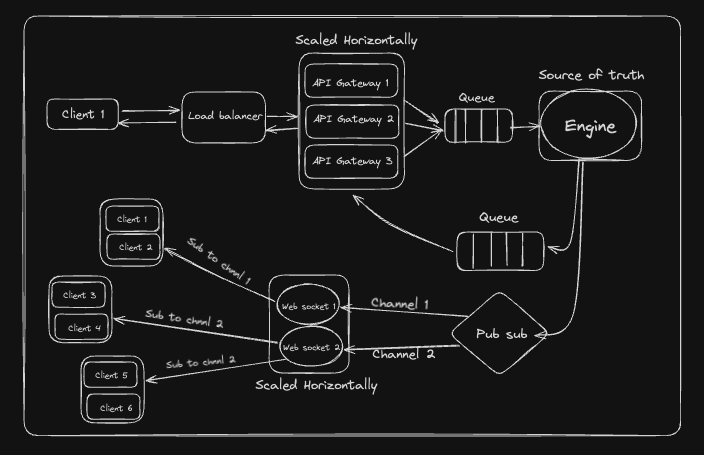

# Opinions Trading Platform

A simple and scalable in-memory opinions trading platform ( like https://probo.in/ ) built with microservices architecture, enabling users to trade on predictions and opinions. The platform consists of three main services: Gateway, Engine, and WebSocket, all connected via Redis for high-performance and low-latency communication.

## Architecture



## Project Structure

```
probo/
├── gateway/          # API Gateway Service
├── engine/           # Core Business Logic Service
├── websocket/        # Real-time WebSocket Service
├── docker-compose.yml
└── README.md
```

The platform uses a microservices architecture with the following components:

- **Gateway Service** : API gateway that handles all incoming HTTP requests and forwards them to the engine via Redis queues
- **Engine Service** : Core business logic service that processes all trading operations, user management, and order matching
- **WebSocket Service** : Real-time communication service for live orderbook updates and market data streaming
- **Redis**: Message broker for inter-service communication using pub/sub pattern and request queues

## Features

- **User Management**: Create users and manage their accounts
- **Symbol Management**: Create and manage trading symbols/stocks
- **Balance Management**: Handle INR and stock balance operations
- **Order Management**: Buy, sell, and cancel orders with real-time matching
- **Real-time Updates**: WebSocket connection for live orderbook updates
- **Scalable Architecture**: Microservices (gateway api and websocket) with Redis-based communication for easy scaling

## Getting Started

### Prerequisites

1. For containerized setup

   - Docker and Docker compose

2. For normal setup
   - Node.js (v14 or higher)
   - Redis server

### Running with Docker (Recommended)

1. Clone the repository:

```bash
git clone "https://github.com/abhayxcode/opinion-trading.git"
cd probo
```

2. Start all services using Docker Compose:

```bash
docker-compose up --build
```

This will start:

- Redis on port 6379
- Gateway service on port 3000
- Engine service on port 8000
- WebSocket service on port 8080

### Running without Docker

#### 1. Start Redis Server

```bash
# Install Redis (macOS)
brew install redis
redis-server

# Or install Redis (Ubuntu)
sudo apt-get install redis-server
sudo systemctl start redis-server
```

#### 2. Set Environment Variables

Copy `.env.example` and create `.env` files in each service directory:

#### 3. Install Dependencies and Start Services

**Terminal 1 - Gateway Service:**

```bash
cd gateway
npm install
npm run dev
```

**Terminal 2 - Engine Service:**

```bash
cd engine
npm install
npm run dev
```

**Terminal 3 - WebSocket Service:**

```bash
cd websocket
npm install
npm run dev
```

### Production Build

For production deployment:

```bash
# Build all services
cd gateway && npm run build
cd ../engine && npm run build
cd ../websocket && npm run build

# Start production servers
cd gateway && npm start
cd ../engine && npm start
cd ../websocket && npm start
```

## API Endpoints

### Base URL

- Gateway Service: `http://localhost:3000`

### User Management

- `POST /user/create/:userId` - Create a new user

### Symbol Management

- `POST /symbol/create/:stockSymbol` - Create a new trading symbol

### Balance Management

- `GET /balances/inr` - Get all INR balances
- `GET /balances/inr/:userId` - Get INR balance for specific user
- `GET /balances/stock` - Get all stock balances
- `GET /balances/stock/:userId` - Get stock balance for specific user
- `POST /onramp/inr` - Add INR to user's account

### Trading Operations

- `POST /order/buy` - Place a buy order
- `POST /order/sell` - Place a sell order
- `POST /order/cancel` - Cancel an existing order

### Orderbook

- `GET /orderbook` - Get all orderbooks
- `GET /orderbook/:stockSymbol` - Get orderbook for specific symbol

### System Operations

- `POST /reset` - Reset the entire in-memory database

### WebSocket Endpoints

Connect to WebSocket server at: `ws://localhost:8080`

#### Subscribe to Orderbook Updates

```json
{
  "type": "SUBSCRIBE",
  "orderbookId": "STOCK_SYMBOL"
}
```

#### Unsubscribe from Orderbook Updates

```json
{
  "type": "UNSUBSCRIBE",
  "orderbookId": "STOCK_SYMBOL"
}
```

## Technology Stack

- **Backend**: Node.js, TypeScript, Express.js
- **WebSocket**: ws library
- **Queue and Pub/Sub**: Redis
- **Containerization**: Docker, Docker Compose
- **Development**: nodemon, ts-node

## Contributing

1. Fork the repository
2. Create a feature branch
3. Make your changes
4. Add tests if applicable
5. Submit a pull request
